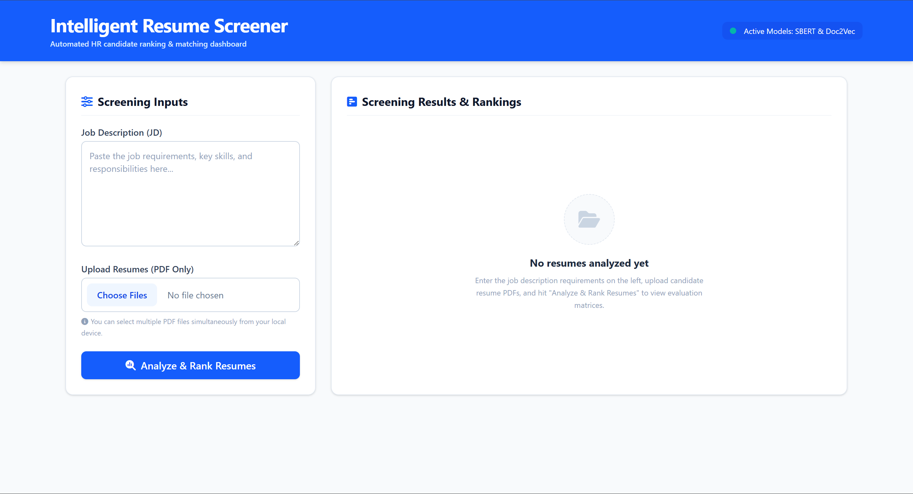
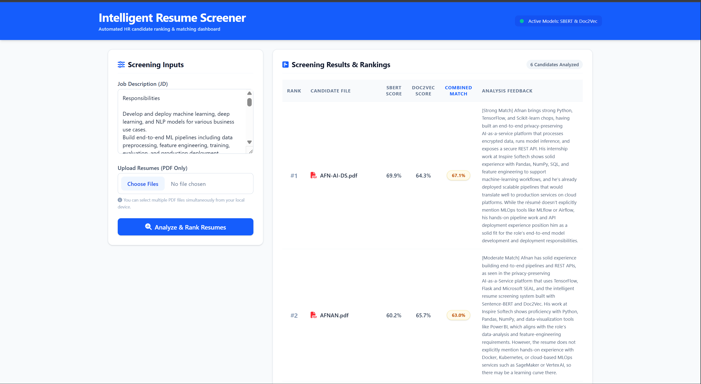
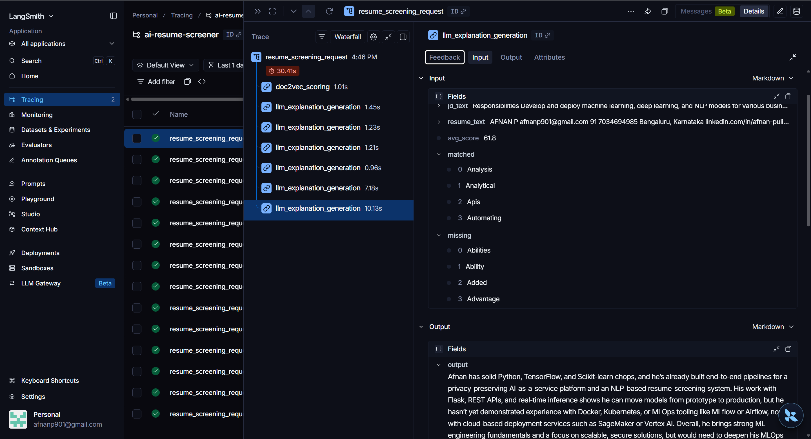

# 🧠 Intelligent Resume Screener

An AI-powered resume screening system that automatically ranks and matches candidate resumes against a job description using dual semantic similarity models (SBERT + Doc2Vec), LLM-generated match explanations, and measured evaluation metrics with production-grade request tracing.

**📊 Evaluation Results:** [see below](#-evaluation)

> This project is designed to run locally. See [Getting Started](#-getting-started) below — setup takes under 5 minutes.

---

## Overview

Recruiters and hiring managers spend hours manually screening resumes against job descriptions. This tool automates that process — upload a job description and a batch of resumes, and the system parses, embeds, scores, and ranks every candidate by relevance, with a genuine written explanation of fit for each one.

Rather than relying on a single model or keyword matching, it combines two independent semantic similarity approaches (SBERT and Doc2Vec) for scoring, and uses an LLM (Llama-based `openai/gpt-oss-20b` via the Groq API) to generate a human-readable explanation of why each candidate is or isn't a good fit — going beyond simple keyword overlap.

---

## 📸 Screenshots

**Screening dashboard**


**Ranked results**


---

## ✨ Key Features

- **Dual-model semantic matching** — combines Sentence-BERT (`all-MiniLM-L6-v2`) and Doc2Vec embeddings for more robust similarity scoring than either model alone
- **LLM-generated match explanations** — uses Groq's `openai/gpt-oss-20b` to synthesize a genuine, readable assessment of each candidate's fit, referencing specific resume content by name, with an automatic rule-based fallback if the API is unavailable
- **PDF parsing** — extracts and cleans text directly from uploaded resume PDFs
- **Batch screening** — upload and rank multiple resumes against a single job description in one pass
- **Match classification** — categorizes each candidate as Strong / Moderate / Low Match based on a measured similarity threshold (see [Evaluation](#-evaluation))
- **Lazy model loading** — the SBERT model loads on first request rather than at startup, keeping the app's baseline memory footprint low
- **Request tracing** — every screening request and LLM call is logged via LangSmith for latency and reliability monitoring
- **Web dashboard** — simple Flask-based UI for uploading JDs/resumes and viewing ranked results

---

## 🛠️ Tech Stack

| Layer | Technology |
|---|---|
| Backend | Python, Flask |
| NLP / Embeddings | Sentence-Transformers (SBERT), Gensim (Doc2Vec), PyTorch |
| Generative AI | Groq API (`openai/gpt-oss-20b`, reasoning model) — match explanation generation |
| PDF Processing | pypdf |
| Evaluation | scikit-learn (precision/recall/F1) |
| Observability | LangSmith (request + LLM call tracing) |
| Config | python-dotenv |

---

## 🏗️ Architecture

```
                     ┌─────────────────────┐
                     │   Job Description    │
                     │     + Resume PDFs    │
                     └──────────┬───────────┘
                                ▼
                     ┌─────────────────────┐
                     │   PDF Text Extraction │
                     │      (pypdf)          │
                     └──────────┬───────────┘
                                ▼
              ┌─────────────────┴─────────────────┐
              ▼                                     ▼
    ┌───────────────────┐               ┌───────────────────┐
    │   SBERT Embedding   │               │  Doc2Vec Embedding  │
    │  + Cosine Similarity│               │   + Similarity      │
    │  (lazy-loaded on     │               │                     │
    │   first request)     │               │                     │
    └──────────┬──────────┘               └──────────┬──────────┘
               └───────────────┬──────────────────────┘
                                ▼
                     ┌─────────────────────┐
                     │   Averaged Score      │
                     │  (SBERT + Doc2Vec)/2  │
                     └──────────┬───────────┘
                                ▼
                     ┌─────────────────────┐
                     │  Threshold Classifier │
                     │ Strong/Moderate/Low   │
                     └──────────┬───────────┘
                                ▼
                     ┌─────────────────────┐
                     │  Groq API call:       │
                     │  generate explanation │
                     │ (fallback: keyword    │
                     │  overlap summary)     │
                     └──────────┬───────────┘
                                ▼
                     ┌─────────────────────┐
                     │  Ranked Results UI    │
                     │ (+ written assessment)│
                     └─────────────────────┘

    [Every request + LLM call traced end-to-end via LangSmith]
```

---

## 📊 Evaluation

Evaluated against a self-constructed ground truth set of 46 JD/resume pairs spanning 7 job categories, hand-labeled for match relevance (`eval/ground_truth.csv`).

### Threshold Analysis (Precision / Recall / F1)

| Threshold | Precision | Recall | F1 |
|---|---|---|---|
| 50 | 0.51 | 1.00 | 0.68 |
| 65 | 0.53 | 1.00 | 0.70 |
| 70 | 0.61 | 0.96 | 0.75 |
| **80** | **0.95** | **0.78** | **0.86** |
| 90 | 1.00 | 0.13 | 0.23 |

**Selected threshold: 80** ("Strong Match" cutoff) — confirmed as optimal by F1 score (0.86), validating the system's configuration through measurement rather than assumption.

### Ranking Quality (Precision@k / Recall@k)

| Metric | Score |
|---|---|
| Precision@1 | 1.00 |
| Precision@3 | 0.81 |
| Recall@5 | 0.96 |

In other words: the top-ranked candidate was correct in every test case, 81% of the top-3 results were genuinely relevant matches, and the top-5 results captured 96% of all truly relevant candidates in the pool.

### Reproduce these results
```bash
python -m eval.run_eval
python -m eval.ranking_eval
```

*Next step (in progress): RAGAS `answer_relevancy` evaluation on the LLM explanation layer, now that a real generation step exists in the pipeline.*

---

## 🔍 Observability

Every screening request — including the SBERT scoring, Doc2Vec scoring, and LLM explanation generation calls — is instrumented with [LangSmith](https://smith.langchain.com) for end-to-end tracing, capturing inputs, outputs, and latency at each step.



---

## 🚀 Getting Started

### Prerequisites
- Python 3.8+
- pip

### Installation

```bash
git clone https://github.com/afnanp901-beep/ai-resume-screener.git
cd ai-resume-screener
python -m venv venv
venv\Scripts\activate      # Windows
source venv/bin/activate   # macOS/Linux
pip install -r requirements.txt
```

### Environment Variables

Create a `.env` file in the project root (see `.env.example`):

```
LANGCHAIN_TRACING_V2=true
LANGCHAIN_API_KEY=your-langsmith-api-key
LANGCHAIN_PROJECT=ai-resume-screener
GROQ_API_KEY=your-groq-api-key
```
(Both are optional — the app runs without them, falling back to no tracing and rule-based keyword feedback respectively. Groq's free tier requires no billing setup.)

### Run

```bash
python app.py
```

Visit `http://127.0.0.1:5000` in your browser. Upload a job description and one or more PDF resumes, then click **Analyze & Rank Resumes**.

> **Note:** the first screening request will take a few extra seconds while the SBERT model downloads and loads (cached locally afterward). LLM explanation calls add roughly 1–3 seconds per resume, since `openai/gpt-oss-20b` is a reasoning model that "thinks" before producing its final answer.

---

## 📁 Project Structure

```
ai-resume-screener/
├── app.py                      # Flask app: routes, SBERT + Doc2Vec scoring, LLM explanation generation
├── templates/                   # HTML templates for the web UI
├── static/                      # CSS/JS assets
├── eval/
│   ├── ground_truth.csv         # Hand-labeled evaluation dataset (46 JD/resume pairs)
│   ├── run_eval.py              # Precision/Recall/F1 evaluation across thresholds
│   ├── ranking_eval.py          # Precision@k / Recall@k ranking evaluation
│   └── threshold_results.csv    # Saved evaluation output
├── docs/
│   └── langsmith-trace.png      # Example trace screenshot
├── requirements.txt
├── .env.example
└── README.md
```

---

## 📈 How It Works (Detail)

1. **Text extraction** — each uploaded resume PDF is parsed into raw text using `pypdf`.
2. **Dual embedding** — the job description and each resume are independently embedded using:
   - **SBERT** (`all-MiniLM-L6-v2`) — a transformer-based sentence embedding model, scored via cosine similarity. Loaded lazily on the first screening request.
   - **Doc2Vec** — a document-level embedding model trained on the fly per request to capture broader contextual similarity.
3. **Score averaging** — the final match score is the mean of the SBERT and Doc2Vec similarity scores.
4. **Classification** — each candidate is labeled Strong / Moderate / Low Match based on the empirically validated threshold of 80 (see [Evaluation](#-evaluation)).
5. **Explanation generation** — the JD, resume, score, and keyword overlap are passed to Groq's `openai/gpt-oss-20b`, which generates a 2–3 sentence written assessment of fit, referencing specific tools and projects from the resume. If the API key is missing or the call fails, the system falls back to a rule-based keyword-overlap summary automatically.
6. **Ranking** — all candidates are sorted by combined score, so the strongest matches appear first.

---

## ⚠️ Known Limitations

- Evaluation is based on a **self-constructed synthetic dataset**, not real hiring outcomes — results may not generalize identically to real-world resume pools.
- LLM explanation quality depends on the underlying model and prompt; not yet formally evaluated (RAGAS `answer_relevancy` eval planned — see Roadmap).
- The explanation model is a *reasoning* model (spends part of its token budget on internal reasoning before producing output) — `max_tokens` must be set generously (1024 in this project) or the response can come back empty, silently triggering the fallback.
- Doc2Vec model is trained fresh per request on a relatively small corpus; performance may vary on resumes with unusual formatting or industry-specific jargon.
- No support for scanned/image-based PDFs (text-based PDFs only).
- Designed for local use; deploying on memory-constrained free hosting tiers (≤512MB) will hit out-of-memory errors due to the combined footprint of PyTorch, Transformers, and SBERT.
- LLM calls add per-request latency (~1–3s per resume) compared to the pure keyword-overlap fallback.

---

## 🗺️ Roadmap

- [ ] Evaluate the LLM explanation layer with RAGAS (`answer_relevancy`, `context_precision`)
- [ ] Expand ground truth dataset with real, anonymized resume data
- [ ] Add a cross-encoder reranking step to improve precision@k further
- [ ] Cache the trained Doc2Vec model across requests instead of retraining per JD
- [ ] Batch export of ranked results (CSV/PDF report)
- [ ] Explore lighter-weight embedding models to enable hosted deployment on free-tier infrastructure

---

## 📜 License

This project is licensed under the MIT License — see the [LICENSE](LICENSE) file for details.

---

## 👤 Author

**Afnan P**
📧 afnanp901@gmail.com
🔗 [LinkedIn](https://linkedin.com/in/afnan-puliyodann) · [GitHub](https://github.com/afnanp901-beep)
